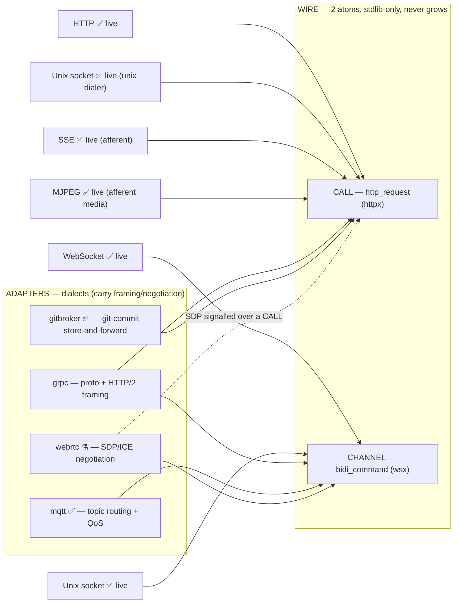

# TRANSPORTS — the wire's extent (9 → 2)

> **For any agent (local or cloud — Claude, DeepSeek, any MCP-tool client) and any human.**
> Machine-readable source of truth: `contract/transports/transports.json` in the `http-mcp` repo (embedded via `//go:embed`, returned verbatim by the http-mcp MCP `transports` tool).
> This file is the prose mirror — it must agree with that JSON (a conformance test guards it).

## The one rule

**The wire is two atoms.** Everything else reduces to them, or is an adapter.

| Atom | Mode | Means | Implementation |
|---|---|---|---|
| `http_request` | **CALL** | one request → one response, then nothing | `internal/httpx` (`net/http`, stdlib) |
| `bidi_command` | **CHANNEL** | one long-lived bidirectional stream | `internal/wsx` (hand-rolled RFC 6455, stdlib) |

> **raw bytes = wire. framing / routing / negotiation = adapter.**
> The wire is deliberately lean: **zero external dependencies** in any `go.mod`. It never grows. New protocols are reached by adapters that present CALL or CHANNEL — the wire never learns about them.

## The full candidate list, mapped

| # | Transport | Mode | Where | Status | Why |
|---|---|---|---|---|---|
| 1 | **HTTP** | CALL | wire | ✅ live | raw request/response — `net/http` |
| 2 | **WebSocket** | CHANNEL | wire | ✅ live | raw full-duplex bytes — `wsx` |
| 3 | **SSE** | CHANNEL (afferent) | wire | ✅ live | server-push over httpx (`text/event-stream`); 8's `/feed` |
| 4 | **MJPEG** | CHANNEL (afferent) | wire | ✅ live | media-push over httpx (`multipart/x-mixed-replace`); 8's `/stream` |
| 5 | **Unix socket** | CALL \| CHANNEL | wire | ✅ live | same bytes, `unix` dialer instead of `tcp` — no framing |
| 6 | **gRPC** | CALL \| CHANNEL | adapter | needs adapter | `.proto` + length-prefixed framing are capability-shaped |
| 7 | **gitbroker** | CALL | adapter | ✅ implemented | store-and-forward relay over git commits; each envelope fires through the witness as CALL-post + CALL-poll (`adapters/gitbroker`) |
| 8 | **MQTT** | CHANNEL | adapter | ✅ implemented | persistent broker relay (stdlib client + broker); the broker CHANNEL is adapter-internal, every envelope fires as a policy-gated `http_request` to the witness (`adapters/mqtt`) |
| 9 | **WebRTC** | CHANNEL | adapter | ⚗️ experimental-primitive | SDP/ICE signalled over a CALL, then a DataChannel with `bidi_command`-shaped exchanges; echo peer only — no witness/relay integration yet (`adapters/webrtc`) |

**9 transports → 2 atoms:** 5 are wire (HTTP, WebSocket, SSE, MJPEG, Unix socket — MJPEG rides as a sibling of SSE), 4 are adapters (gRPC, gitbroker, MQTT, WebRTC). Only gRPC still needs building; gitbroker and MQTT are implemented, WebRTC is an experimental primitive.

## How the four-body system "knows" all of them, leanly

| Arm | Repo | Role in the transport story |
|---|---|---|
| **WIRE** | `http-mcp` | owns the 2 atoms + the `unix` transport option; serves `transports.json` via the `transports` tool |
| **WITNESS** | `8` | observes any channel read-only (SSE/MJPEG/ws); never drives |
| **HOST** | `pilot` | composes atoms; imports an adapter when a dialect is needed |
| **ADAPTERS** | `adapters` | one folder per dialect (`grpc/`, `gitbroker/`, `mqtt/`, `webrtc/`), each with `capabilities.json` declaring how it maps to CALL/CHANNEL |

## What an agent reads, in order

1. **`transports` tool** (or the `http-mcp` repo's `contract/transports/transports.json`) → the whole 9→2 map in one call.
2. **`adapters/<name>/capabilities.json`** → only if you need a non-wire transport.
3. **This file** → prose + diagram fallback, linked from every README.

> **One line:** *the wire is `http_request` (CALL) + `bidi_command` (CHANNEL); `discover`/`transports` returns the full map; Unix is wire; gRPC/gitbroker/MQTT/WebRTC are adapters because they carry framing.*
